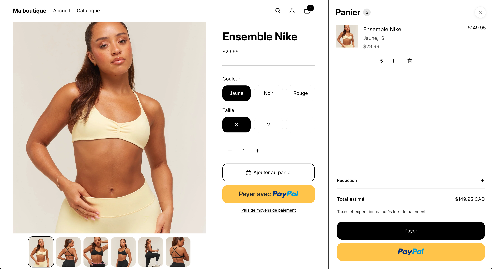
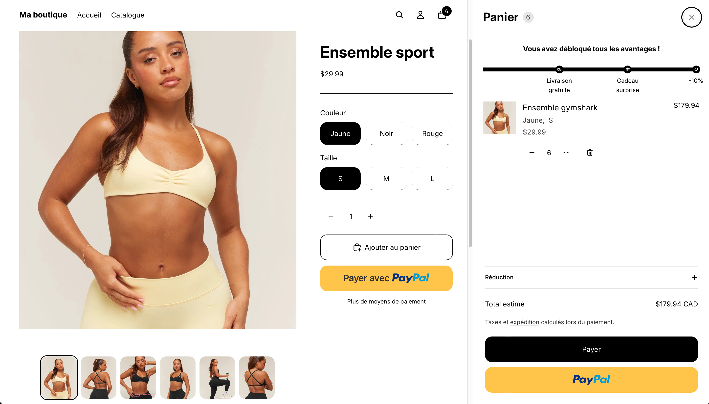

<a href="README.fr.md">Lire en français</a>

# Shopify Free Shipping Bar — progressive cart drawer bar

A theme-native, multi-tier progress bar for the cart drawer: the customer
sees how close they are to free shipping (or any reward you configure), with
up to 3 tiers on a single segmented bar — one segment per tier, each filling
independently and stopping exactly at its own marker once reached.

Built for the **Shopify Horizon** theme. No third-party app, no monthly fee,
no JavaScript at all — the fill animation runs on the theme's existing DOM
morphing, not a custom script.

| Before | After |
|---|---|
|  |  |

## Features

- Up to 3 configurable tiers, each with its own amount, reward label, and
  icon (truck, gift, discount tag, or none)
- Segmented fill — each tier's portion of the bar fills independently and
  stops exactly at its marker once reached, instead of one bar that
  overshoots past reached tiers
- Smooth fill animation with **zero JavaScript**, thanks to Horizon's
  existing DOM-morphing cart updates (see `docs/gotchas.md` for why this
  works and when it wouldn't)
- Configurable bar color, bar thickness, marker size, and icon size —
  all from the theme editor, no code changes
- Fully bilingual out of the box (English + French); add more languages by
  extending the locale files
- Respects `prefers-reduced-motion`
- Accessible: `role="progressbar"` with `aria-valuenow`/`min`/`max` and a
  translated `aria-label`

## Repository contents

This repo contains **only the custom code for this feature** — not the full
Horizon theme, which belongs to Shopify. You drop these files into an
existing Horizon (or Horizon-based) theme.

| Path | What it is |
|---|---|
| `snippets/free-shipping-bar.liquid` | The whole feature — markup, tier/segment calculations, and scoped CSS in one file |
| `assets/icon-truck.svg`, `assets/icon-gift.svg` | The two custom icons (a discount-tag icon is assumed to already exist in most Horizon themes as `icon-discount.svg`) |
| `locales/*.json`, `locales/*.schema.json` | English + French translations (storefront text and editor labels) |
| `docs/settings-schema-snippet.json` | The exact JSON to paste into your theme's `config/settings_schema.json` |
| `docs/integration-guide.md` | Step-by-step install instructions |
| `docs/gotchas.md` | Technical pitfalls discovered while building this, so you don't re-hit them |

## Quick start

1. Copy `snippets/free-shipping-bar.liquid` and the two icon assets into
   your theme.
2. Paste `docs/settings-schema-snippet.json` into your theme's
   `config/settings_schema.json`, and add the translation keys from
   `locales/` to your own locale files.
3. Add `` in your `cart-drawer.liquid`, right
   after the drawer's title/header (both the empty-cart and has-items
   states — see `docs/integration-guide.md` for exact anchor points).
4. Configure tiers, colors, and sizes from the theme editor.

## Known limitation: displayed reward vs. what's actually applied

This bar is **display-only**. Reaching a tier does not automatically apply
a discount, add a free gift, or change the shipping rate — it just tells the
customer they've reached a threshold. To make the real cart behavior match
what's shown, you need one of:

1. **A matching native Shopify discount or shipping rate**, configured
   manually in Admin → Discounts / Settings → Shipping (simplest, no code —
   requires keeping the theme settings and the Shopify config in sync by
   hand)
2. **A Shopify Function** that reads the cart subtotal and applies the
   reward automatically (clean, reliable, but a full app-extension build —
   not theme code)

Decide this with whoever owns the store *before* configuring tier amounts —
if the numbers drift apart, the bar can promise something checkout doesn't
deliver.

## License

MIT
